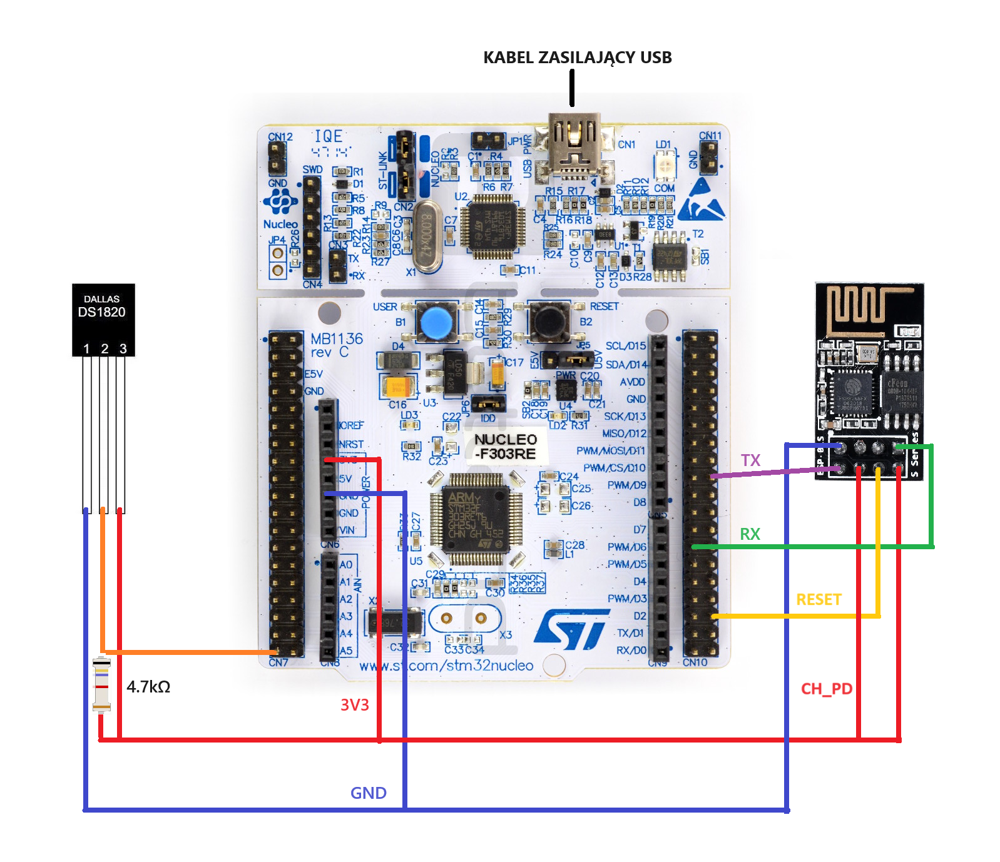

# Stacja Meteo z Wykorzystaniem Technologii IoT - Embedded

## Opis Projektu

Projekt stacji meteo wykorzystującej technologie IoT do monitorowania i analizy warunków atmosferycznych. System zbiera dane z czujników i przesyła je do serwera, gdzie są one przechowywane w bazie danych i prezentowane za pomocą aplikacji webowej (znajdującej się w osobnym repozytorium).

## Cel Projektu

Głównym celem projektu jest stworzenie systemu umożliwiającego monitorowanie i analizę warunków atmosferycznych w sposób dokładny, niezawodny i łatwy w użyciu. Dzięki temu użytkownicy będą mogli uzyskać dostęp do aktualnych danych meteorologicznych na podstawie pomiarów przeprowadzanych przez stację meteo. Istotą projektu jest dostarczenie użytkownikom informacji na temat temperatury, wilgotności, natężenia światła itp., które są kluczowe dla wielu dziedzin życia, od codziennego planowania aktywności po profesjonalne aplikacje związane z monitorowaniem środowiska.

## Technologia

Projekt wykorzystuje następujące technologie:
- **Mikrokontroler STM32F303RE** - centralna jednostka zarządzająca.
- **Czujnik DS18B20** - pomiar temperatury.
- **Moduł WiFi ESP-01s** - komunikacja bezprzewodowa.
- **HTTP** - przesyłanie danych.

## Struktura Oprogramowania

Oprogramowanie składa się z trzech głównych modułów:
1. **Moduł Pomiarowy**: Zbieranie i przetwarzanie danych z czujników.
2. **Moduł Komunikacyjny**: Przesyłanie danych do serwera za pomocą ESP-01s i HTTP.
3. **Moduł Prezentacji**: Przechowywanie danych w bazie MySQL i prezentacja za pomocą aplikacji webowej (PHP) w osobnym repozytorium.

## Konfiguracja Projektu

### Schemat Połączeń Mikrokontrolera z Peryferiami

Mikrokontroler STM32F303RE jest podłączony przez kabel micro-AB USB.

#### Podłączenie czujnika DS18B20
- **Pin DQ**: Podłączony do pinu GPIO PC3 mikrokontrolera STM32F303RE.
- **Rezystor podciągający**: 4.7k ohm podłączony między linią danych czujnika a zasilaniem (3.3V).
- **Zasilanie (VDD) i masa (GND)**: Podłączone odpowiednio do napięcia zasilania (3.3V) i masy mikrokontrolera.

#### Podłączenie modułu WiFi ESP-01s
- **Zasilanie (VCC) i masa (GND)**: Podłączone do 3.3V i GND mikrokontrolera STM32F303RE.
- **Pin RX**: Podłączony do pinu PB10 (TX portu szeregowego UART2) mikrokontrolera.
- **Pin TX**: Podłączony do pinu PB11 (RX portu szeregowego UART2) mikrokontrolera.
- **Pin CH_PD**: Podłączony do napięcia zasilania (3.3V). Zalecane podłączenie do pinu GPIO w przyszłości.
- **Pin RESET**: Podłączony do pinu GPIO PC4, umożliwiający reset modułu WiFi z poziomu programu.

---

# IoT Weather Station - Embedded

## Project Description

The IoT weather station project aims to monitor and analyze atmospheric conditions using IoT technologies. The system collects sensor data and transmits it to a server where it is stored in a database and presented via a web application (located in a separate repository).

## Project Goal

The main goal of the project is to create a system for accurate, reliable, and user-friendly monitoring and analysis of atmospheric conditions. This allows users to access real-time meteorological data based on measurements conducted by the weather station. The essence of the project is to provide users with information on temperature, humidity, light intensity, etc., which are crucial for various applications ranging from daily activity planning to professional environmental monitoring.

## Technology

The project utilizes the following technologies:
- **STM32F303RE Microcontroller** - central processing unit.
- **DS18B20 Temperature Sensor** - temperature measurement.
- **ESP-01s WiFi Module** - wireless communication.
- **HTTP** - data transmission.

## Software Structure

The software consists of three main modules:
1. **Measurement Module**: Collects and processes data from sensors.
2. **Communication Module**: Transmits data to the server using ESP-01s and HTTP.
3. **Presentation Module**: Stores data in a MySQL database and presents it via a web application (PHP) in a separate repository.

## Project Configuration

### Microcontroller Peripherals Connection Diagram

The STM32F303RE microcontroller is connected via a micro-AB USB cable.

#### DS18B20 Sensor Connection
- **DQ Pin**: Connected to GPIO pin PC3 of the STM32F303RE microcontroller.
- **Pull-up Resistor**: 4.7k ohms connected between the sensor data line and the 3.3V supply, ensuring proper 1-Wire communication.
- **Power (VDD) and Ground (GND)**: Connected to the microcontroller's power (3.3V) and ground.

#### ESP-01s WiFi Module Connection
- **Power (VCC) and Ground (GND)**: Connected to 3.3V and GND of the STM32F303RE microcontroller.
- **RX Pin**: Connected to PB10 pin (TX of UART2) of the microcontroller.
- **TX Pin**: Connected to PB11 pin (RX of UART2) of the microcontroller.
- **CH_PD Pin**: Connected to the 3.3V power supply. Recommended to connect to a GPIO pin for future control.
- **RESET Pin**: Connected to GPIO pin PC4, enabling reset of the WiFi module programmatically.

